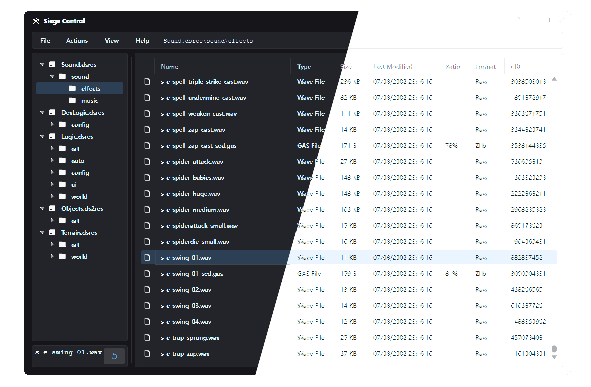

    
  <h3 align="center">Siege Control</h3>

  

    A Windows app used to view and extract Dungeon Siege 1 and 2 tank files
  

## About The Project
Siege Control has been created based on Dan Strandberg's [Tank Viewer](https://www.siegetheday.org/?q=node/3044) and Guilherme Lampert's [Dungeon Siege Reverse Engineering project](https://github.com/glampert/reverse-engineering-dungeon-siege). Because the Tank extraction tools are old and non open-source, I decided to port basic functionality of Tank Viewer as a standalone [Avalonia UI](https://avaloniaui.net/) app.

    

## Features
* Open, browse and extract Dungeon Siege 1 and Dungeon Siege 2 Tank files
* Preview .wav, .mp3, .skrit and .gas files from inside the app
* View tank and file info
* Beautiful interface with a dark and light theme and modern design
* Built with performance in mind
* Features a SiegeLib library desgined to handle Tank files
* Tested with DS1 1.11.1.1486 and DS2 2.30.0.0

## Planned features
- [ ] SiegeLib: create new tank files
- [ ] App: drag & drop support for extracting files
- [ ] App: localisation support
- [ ] App: save game editor
- [ ] App: preview support for textures

## Development
### Building
Currently, only Windows is natively supported. Building should be as straightforward as running a dotnet app. You'll need .NET 8 to build it.

### Contributing
Feel free to submit any pull requests and I will happily review them. 

### Running unit tests
In order to run the unit tests, you'll need to create a `TestConfig.json` file. See `TestConfig.json.sample`. Tests require owning copies of DS1 and DS2.

# License 
Distributed under the GNU Affero General Public License v3.0. See `LICENSE` for more information.
